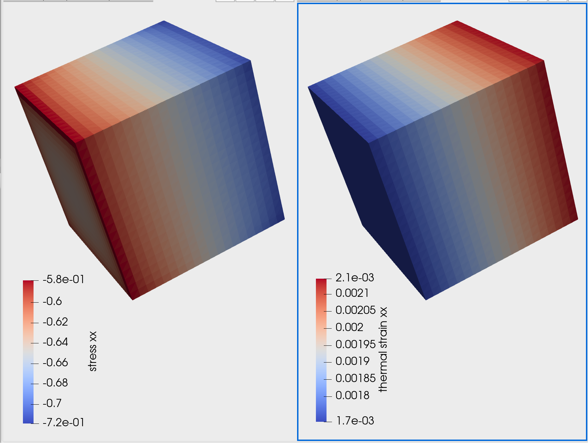

# Thermal Expansion Demo

This suite provides three simple examples illustrating how to use thermal expansion in the linear elasticity formulation.

Note that this is an uncoupled calculation--there is no thermal solution. The assumption is that the temperature field is known, so the thermal expansion tensor field can be calculated and considered input data to the problem.

We set up three simple cases to illustrate how to run it. The first two are very simple and just show that it is working correctly. The third uses real material properties and a constructed temperature field.

## Examples
There are three examples here. The first two are a simple check to show that it is working right. Think of the thermal expansion as changing the reference configuration to a new stress-free configuration--at that temperature, the expanded configuration is stress free.  So a displacement field that matches the thermal expansion would have zero stress, and a zero displacement field would have a compressive strain/stress, opposite of the thermal strain.

The first two examples show that. They both use the simple material with identity for stiffness, so the stress is exactly the same matrix as the strain (ignoring units).   In the second example, the displacement fields match the thermal strain, and so the stress is zero, and the mechanical strain (from displacements) is exactly the thermal strain.

1. The first example, `zero`, has zero displacement boundary conditions and a constant thermal expansion. It results in zero mechanical strain and a stress that is the negative of the thermal strain.

2. The second example, `match`, has displacement boundary conditions exactly matching the thermal strain field. It results in zero stress and the mechanical strain field is identical to the thermal strain.

3. The third example, `linear`, illustrates a typical application. It uses stiffness values for a real material, and the temperature difference varies linearly.  Again, we use zero displacements and see in the plots below that the stress varies like the negative of the thermal stress.

## Inputs
As usual in `polycrystalx`, there are four inputs, and each is specified by a `key`.

### Material
There is a material database with two linear elastic materials. The `key` is the name of the material in the database. The two names are `identity-iso` and `ti-64-bar-RT`. The first is simple material with stiffness the identity matrix.  The second is isotropic and comes from matweb ([[Ti64](https://www.matweb.com/search/DataSheet.aspx?MatGUID=10d463eb3d3d4ff48fc57e0ad1037434)).

### Microstructure
For this demo, the materials are isotropic, so there is no variation in the microstructure (single grain). So the key is not used, and the name component `sx` (for single crystal) is used for output files.

### Mesh
The mesh is a simple box mesh on the unit cube.  The `key` is a 3-tuple of subdivisions, e.g. `(50, 50, 50)` for regular subdivisions, fifty in each direction.

### Deformation
The deformations are described above. The `key` is the name of the example: "zero", "match" or "linear". Boundary conditions are set as described above.
